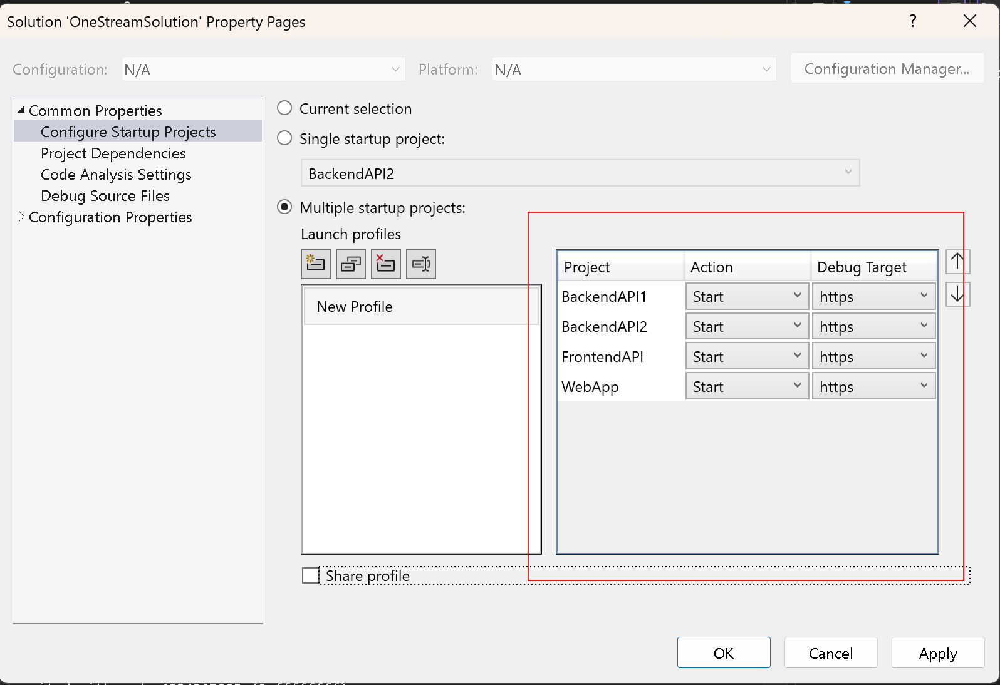

# OneStreamSolution

A .NET 9 solution with multiple projects including backend APIs, a frontend API, and a Blazor web application.

## Getting Started

### Startup Configuration

Make sure the Startup Configuration looks as follows:

The solution should be configured to run multiple startup projects:
- **BackendAPI1** - Start (https)
- **BackendAPI2** - Start (https)
- **FrontendAPI** - Start (https)
- **WebApp** - Start (https)

To configure this in Visual Studio:
1. Right-click on the solution in Solution Explorer
2. Select __Configure Startup Projects...__
3. Select __Multiple startup projects__
4. Set the Action to "Start" for all four projects
5. Click Apply and OK

